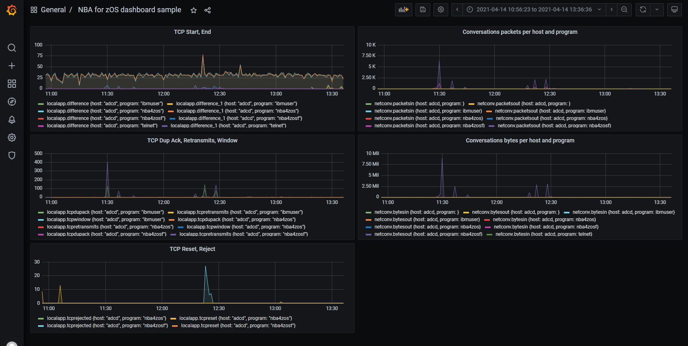

# TDSLink - NBA for z/OS integration with InfluxDB and Grafana

This page describes how to integrate **NBA for z/OS** metrics into InfluxDB using InfluxData's Telegraf agent.

## Measurements Overview

- Local & Remote application measurements

```
localapp,host="adcd",proto="tcp",serverport=22,program="sshd4" packetsin=0,packetsout=0,bytesin=0,bytesout=0,maxppsin=0,maxppsout=0,maxbpsin=0,maxbpsout=0,tcpstart=0,tcpend=0,tcprejected=0,tcphostrt=0,tcpnetwrt=0,tcpdupack=0,tcpretransmit=0,tcpwindow=0,tcpstartinprivate=0,tcpstartinpublic=0,tcpstartoutprivate=0,tcpstartoutpublic=0,tcpendin=0,tcpendout=0,tcpreset=0,conversations=0 1618398282000000000
localapp,host="adcd",proto="tcp",serverport=23,program="telnet" packetsin=629,packetsout=676,bytesin=31014,bytesout=472169,maxppsin=9,maxppsout=9,maxbpsin=3606,maxbpsout=67554,tcpstart=5,tcpend=2,tcprejected=0,tcphostrt=106,tcpnetwrt=8,tcpdupack=1,tcpretransmit=3,tcpwindow=0,tcpstartinprivate=5,tcpstartinpublic=0,tcpstartoutprivate=0,tcpstartoutpublic=0,tcpendin=0,tcpendout=2,tcpreset=0,conversations=2,bytesintopip="10.1.1.170",bytesouttopip="10.1.1.170" 1618398282000000000
remoteapp,host="adcd",rem_prot="tcp",rem_port=21,rem_ip="10.1.1.33",rem_stack_name="tcpip",rem_agr_name="ftp\ control" rem_pkt_in=135,rem_pkt_out=123,rem_byt_in=10583,rem_byt_out=7846,rem_pps_in=5,rem_pps_out=5,rem_bps_in=3545,rem_bps_out=2626,rem_pkt_64_in=31,rem_pkt_128_in=104,rem_pkt_256_in=0,rem_pkt_512_in=0,rem_pkt_1024_in=0,rem_pkt_1025_in=0,rem_pkt_64_out=76,rem_pkt_128_out=47,rem_pkt_256_out=0,rem_pkt_512_out=0,rem_pkt_1024_out=0,rem_pkt_1025_out=0,rem_pkt_frag_in=0,rem_pkt_frag_out=0,rem_tcp_cn_sta=9,rem_tcp_cn_sto=10,rem_tcp_cn_rej=0,rem_tcp_cn_act=0,rem_max_hrt=280,rem_avg_hrt=11,rem_max_nrt=56,rem_avg_nrt=4,rem_tcp_dup_ack=0,rem_tcp_retrmt=0,rem_tcp_window=0,rem_hrt_inf_1=66,rem_hrt_inf_2=0,rem_hrt_inf_5=0,rem_hrt_inf_10=0,rem_hrt_sup_10=0,rem_nrt_inf_1=66,rem_nrt_inf_2=0,rem_nrt_inf_5=0,rem_nrt_inf_10=0,rem_nrt_sup_10=0,rem_frag_in_per=0.00,rem_frag_out_per=0.00,rem_dup_ack_per=0.00,rem_retrmt_per=0.00,rem_window_per=0.00 1618398393000000000
```

- Interface & Network measurements

```
interface,host="adcd",int_tcpip="tcpip",int_link_name="lnkvipa",int_ip="192.168.9.1" int_pkt_in=72179,int_pkt_out=178366,int_byt_in=4501888,int_byt_out=197101581,int_pps_in=426,int_pps_out=2147,int_bps_in=138011,int_bps_out=24109041,int_pkt_64_in=58223,int_pkt_128_in=4760,int_pkt_256_in=9010,int_pkt_512_in=86,int_pkt_1024_in=100,int_pkt_1025_in=0,int_pkt_64_out=19064,int_pkt_128_out=166,int_pkt_256_out=20212,int_pkt_512_out=11142,int_pkt_1024_out=1926,int_pkt_1025_out=125856,int_pkt_frag_in=0,int_pkt_frag_out=0,int_tcp_cn_sta=5626,int_tcp_cn_sto=5749,int_tcp_cn_rej=56,int_tcp_cn_act=5,int_icmp_in=1129907,int_icmp_out=319,int_igmp_in=0,int_igmp_out=0,int_tcp_in=3136616,int_tcp_out=193877940,int_igrp_in=0,int_igrp_out=0,int_udp_in=235365,int_udp_out=3223322,int_gre_in=0,int_gre_out=0,int_esp_in=0,int_esp_out=0,int_ah_in=0,int_ah_out=0,int_eigrp_in=0,int_eigrp_out=0,int_ospf_in=0,int_ospf_out=0,int_l2tp_in=0,int_l2tp_out=0,int_othr_in=0,int_othr_out=0,int_tcp_dup_ack=70,int_tcp_retrmt=1004,int_tcp_window=404,int_load_in=0.00,int_load_out=0.00,int_frag_in_per=0.00,int_frag_out_per=0.00,int_dup_ack_per=0.03,int_retrmt_per=0.40,int_window_per=0.16,int_req_per_min=0,int_sta_in_priv=5626,int_sta_in_pub=0,int_sta_out_priv=0,int_sta_out_pub=0,int_sto_in=40,int_sto_out=5584,int_tcp_cn_res=2 1618398657000000000
network,host="adcd",net_ipaddr="10.1.1" net_pkt_in=71593,net_pkt_out=195138,net_byt_in=3577211,net_byt_out=242301404,net_pps_in=439,net_pps_out=2147,net_bps_in=141190,net_bps_out=24108786,net_pkt_64_in=65930,net_pkt_128_in=1544,net_pkt_256_in=3934,net_pkt_512_in=85,net_pkt_1024_in=100,net_pkt_1025_in=0,net_pkt_64_out=18955,net_pkt_128_out=213,net_pkt_256_out=5143,net_pkt_512_out=11117,net_pkt_1024_out=1935,net_pkt_1025_out=157775,net_pkt_frag_in=0,net_pkt_frag_out=0,net_tcp_cn_sta=5587,net_tcp_cn_sto=5711,net_tcp_cn_rej=61,net_tcp_cn_act=5,net_icmp_in=319,net_icmp_out=319,net_igmp_in=0,net_igmp_out=0,net_tcp_in=3576892,net_tcp_out=241499005,net_igrp_in=0,net_igrp_out=0,net_udp_in=0,net_udp_out=802080,net_gre_in=0,net_gre_out=0,net_esp_in=0,net_esp_out=0,net_ah_in=0,net_ah_out=0,net_eigrp_in=0,net_eigrp_out=0,net_ospf_in=0,net_ospf_out=0,net_l2tp_in=0,net_l2tp_out=0,net_othr_in=0,net_othr_out=0,net_max_hrt=5125,net_avg_hrt=61,net_max_nrt=69,net_avg_nrt=8,net_tcp_dup_ack=1414,net_tcp_retrmt=2957,net_tcp_window=404,net_hrt_inf_1=5840,net_hrt_inf_2=7,net_hrt_inf_5=5,net_hrt_inf_10=1,net_hrt_sup_10=0,net_nrt_inf_1=269,net_nrt_inf_2=0,net_nrt_inf_5=0,net_nrt_inf_10=0,net_nrt_sup_10=0,net_frag_in_per=0.00,net_frag_out_per=0.00,net_dup_ack_per=0.53,net_retrmt_per=1.11,net_window_per=0.15 1618398546000000000
```

- Network Conversations measurements (last minute statistics)

```
netconv,clientip=10.1.1.33,clientport=31267,host=adcd,program=ibmuser,proto=tcp,serverip=192.168.9.1,serverport=81 bytesin=92i,bytesout=48i,packetsin=2i,packetsout=1i,sizein=46i,sizeout=48i,windowsizein=255i,windowsizeout=255i 1618400293000000000
netconv,clientip=10.1.1.33,clientport=30638,host=adcd,program=ibmuser,proto=tcp,serverip=192.168.9.1,serverport=81 bytesin=121i,bytesout=80i,packetsin=3i,packetsout=2i,sizein=40i,sizeout=40i,windowsizein=255i,windowsizeout=255i 1618400293000000000
netconv,clientip=10.1.1.33,clientport=17456,host=adcd,program=telnet,proto=tcp,serverip=192.168.9.1,serverport=23 bytesin=374i,bytesout=534i,packetsin=7i,packetsout=9i,sizein=53i,sizeout=59i,windowsizein=255i,windowsizeout=255i 1618400293000000000
```


## Get Telegraf executable and sample configuration

1. Get Telegraf agent executable from [Influx Data download page](https://portal.influxdata.com/downloads).

2. Get Telegraf's sample configuration [here](telegraf.conf) (`telegraf.conf`) and place it next to Telegraf executable.

This file comes with Telegraf's inputs already defined. You just have to change NBA for z/OS contact URL and authentication settings.

## Configure Inputs in Telegraf.conf

1. Search for `[[inputs.http]]` sections (lines 104, 137) and replace `{nbaforzos_url}` with your NBA for z/OS URL (ex: http://10.1.1.1:80)


```
    # Input 1: Retrieve z/OS Statistics
    [[inputs.http]]
    
      #
      urls = [
        "{nbaforzos_url}/api/stats/lapp",
        "{nbaforzos_url}/api/stats/rapp",
        "{nbaforzos_url}/api/stats/netw",
        "{nbaforzos_url}/api/stats/intf"
      ]
    ...
    # Input 2: Get Network z/OS Conversations (CSV)
    [[inputs.http]]
    
      #
      urls = [
        "{nbaforzos_url}/api/netconv"
      ]

```

2. In both `[[inputs.http]]` sections, you can set additional HTTP parameters:
  - HTTP Basic Auth Credentials with username and password
  - Proxy URL
  - TLS configuration


## Configure Output in Telegraf.conf

Default output is InfluxDB, please customize the `[[outputs.influxdb]]` section in order to set your InfluxDB target host.


## Testing metrics

In order to test NBA for z/OS measurements collected, you can run `telegraf --config telegraf.conf --test`. Telegraf will write collected measurements to its standard output.


## Grafana Dashboard snapshots



## Copyright

© Copyright ServicePilot Inc 2023
