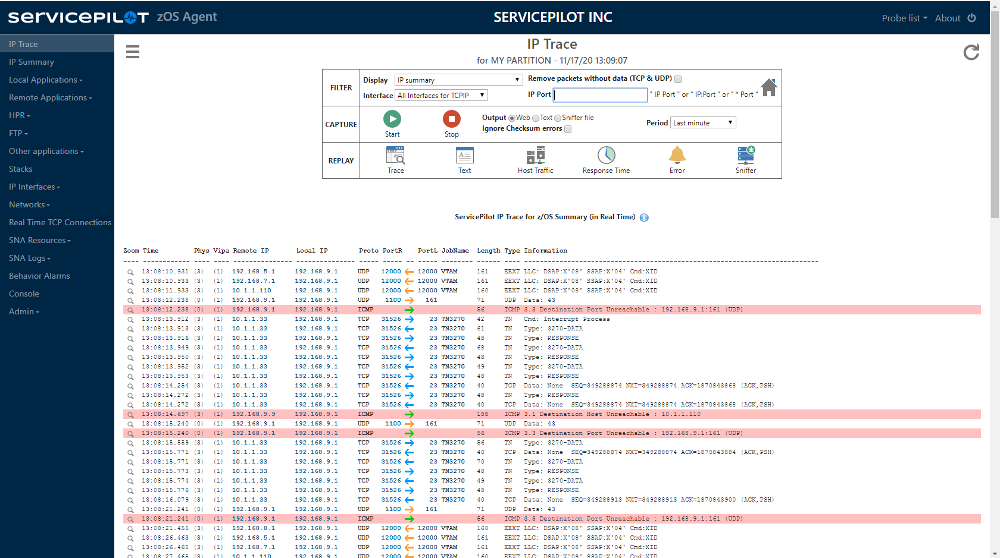
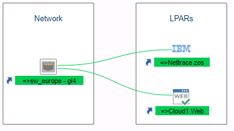
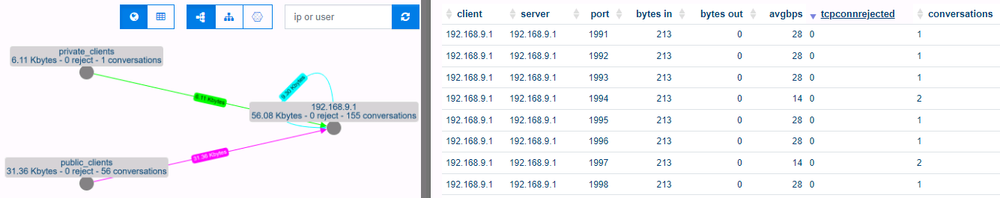
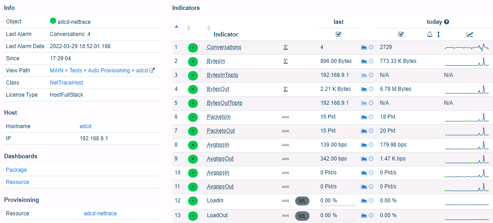
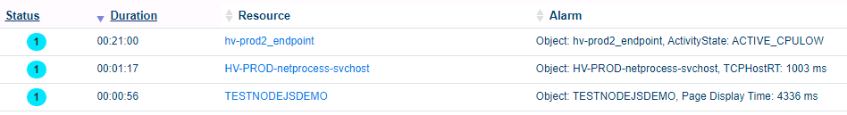

# ServicePilot TDSLink - NBA for z/OS

Network **tracing** for z/OS

Network **performance & activity** monitoring for z/OS

Version 9.0 Level 22182: from z/OS v1r5 to z/OS v2r5

## Free version

NBA for z/OS Free Edition captures all the IP traffic flowing through the IP dataspace. This traffic can be viewed, either while the trace is running, or once it has been archived. NBA for z/OS Free Edition complies with RACF and supports multiple IP stacks and can be secured with HTTPS: 

- A real-time and easy-to-use IP tracing tool. A single click starts a trace on the mainframe
- Trace data can be saved in PCAP or text format for analysis with third party tools
- Trace filtering on IP address, port number and interface
- User-friendly interface to display a meaningful presentation of the trace
- Limit capture duration to 1 minute, 15 minutes or unlimited

## Commercial version

NBA for z/OS Full Edition can be used either by network or security engineers.

- All the free features: realtime traces, export as PCAP, ...
- Activity Monitoring: Interface activity, local and remote application activity, Network activity, Response time
- Performance: IP Traffic, IP Maximum load, Top ten traffic, Top ten host and network response times, TCP active connections, TCP start/stop/reject connections, TCP/IP buffer
- Operations and Diagnosis
- Alerts: SNMP Trap, WTO, Logs, Syslog, e-mail
- Collects system logs

More information: [ServicePilot web site](https://www.servicepilot.com/en/application-flow/mainframe/)

A free month's trial is available on demand. Do not hesitate to request one at: [support@servicepilot.com](mailto:support@servicepilot.com?subject=ServicePilot%20NBA%20for%20z/OS%20Full%20Edition)

### Full Edition APIs

 - [APIs](Integrations/README.md)

### Full Edition Integrations

NBA for z/OS integration is possible with the following tools:

- [ServicePilot](Integrations/servicepilot/README.md): Sends events & metrics to ServicePilot **SaaS** or **On premise**
  - ServicePilot allows you to visualize the data collected by NBA for z/OS and integrate it with other parts of your infrastructure. For example present the status of your LPARs along side network switch status: 
  - ServicePilot presents network traces collected by NBA for z/OS graphically with the possibility of filtering and viewing the associated detail: 
  - ServicePilot summarizes network flow data as numerical indicators and performs *Machine Learning* calculations to generate trends and intelligent alerts: 
  - ServicePilot allows you to set thresholds, query the data collected and alert conditions critical to your environment: 
- [InfluxDB / Grafana](Integrations/influxdb/README.md): Sends metrics to InfluxDB and compatible software packages like Grafana

You are welcome to contribute to NBA for z/OS with integration samples. Feel free to contact us at [support@servicepilot.com](mailto:support@servicepilot.com?subject=ServicePilot%20NBA%20for%20z/OS%20Full%20Edition%20Integration%20samples) to discuss proposals and pose queries.

## Installation & Security consideration

 - [Download](TDSLink-NBA_for_zOS.zip)
 - [Install](Install.md)
 - [TLS security](https.md)

## Support

Whether you are using the free version or the commercial version, all questions and requests are welcome. You can contact us at: [support@servicepilot.com](mailto:support@servicepilot.com?subject=ServicePilot%20NBA%20for%20z/OS%20Full%20Edition)

## License

[Free & Commercial license](https://www.servicepilot.com/resources/eula_en.pdf)

## Copyright

© Copyright ServicePilot Inc 2022
